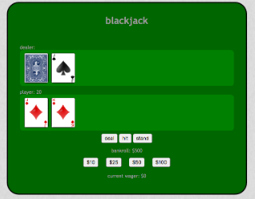

# Blackjack

## Overview
* A game of Blackjack built with JavaScript and jQuery. Play Blackjack against the computer and try to win! You can place a bet if you think you have a better hand! This game was built with JavaScript and jQuery to deal the cards, check for wins, add up points, and check math on bets.

### Technologies, frameworks, & programming Languages used
* HTML5 & CSS3
* JavaScript
* jQuery

### Url to live demo

[Check it out](http://danielblackjack.surge.sh/)
